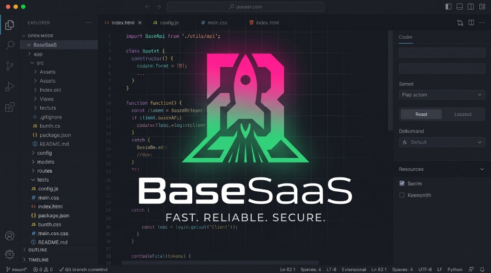
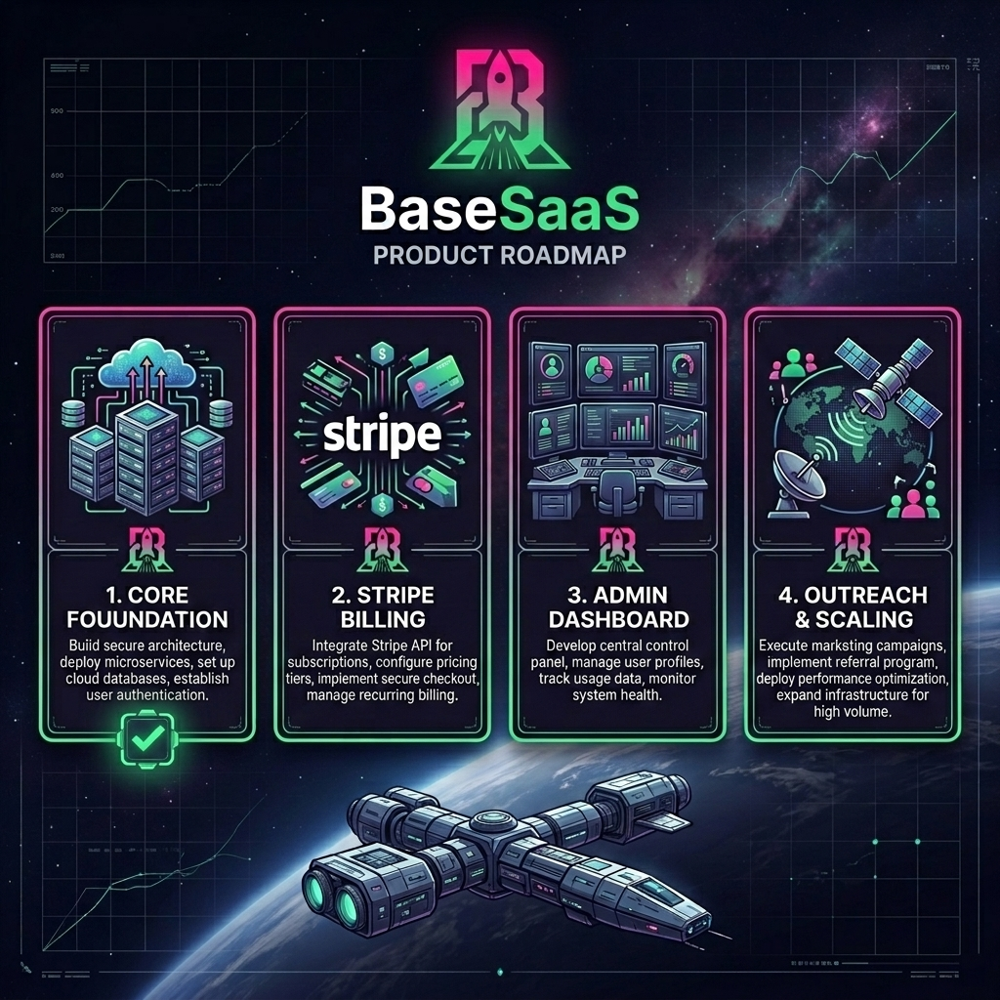

<p align="center">
  
</p>

<h1 align="center">🚀 BaseSaaS</h1>

<p align="center">
  <b>The Ultimate, Highly Scalable, and Production-Ready Boilerplate for your Next SaaS!</b>
  <br />
  <sub>Meticulously designed with Angular 21+, Supabase, Vitest, and Transloco to launch your idea in record time.</sub>
</p>

<div align="center">
  <table style="border: 1px solid #30363d; border-radius: 12px; background-color: #0d1117; margin: 24px 0; max-width: 500px; border-collapse: separate;">
    <tr>
      <td align="center" style="padding: 24px; border: none;">
        <h4 style="margin: 0 0 8px 0; color: #58a6ff; font-family: system-ui, -apple-system, sans-serif; font-size: 15px; letter-spacing: 0.5px;">🌍 DOCUMENTATION LANGUAGE / IDIOMA</h4>
        <p style="margin: 0 0 16px 0; font-size: 12.5px; color: #8b949e; font-family: system-ui, -apple-system, sans-serif; line-height: 1.4;">
          Escolha seu idioma abaixo para alternar o contexto de leitura:<br/>
          <i>Choose your language below to swap the context instantly:</i>
        </p>
        <table align="center" style="border: none; border-collapse: collapse;">
          <tr>
            <td style="padding: 0 8px; border: none;">
              <a href="README.pt.md">
                
              </a>
            </td>
            <td style="padding: 0 8px; border: none;">
              <a href="README.md">
                
              </a>
            </td>
          </tr>
        </table>
      </td>
    </tr>
  </table>
</div>

<p align="center">
  
  
  
  
  
  
  
</p>

---

## ✨ From Idea to First Revenue in Record Time! 💸

Are you tired of spending **entire days** configuring database connections, complex login systems, slow routes, and repetitive testing setups every single time you have a brilliant idea for a new SaaS? 🥱

**BaseSaas** is the ultimate enterprise-grade solution. It has been meticulously built with **Angular 21+** and **Supabase** to provide an ultra-premium, responsive, and ready-to-scale commercial foundation. You skip the heavy lifting infrastructure setup and focus purely on what puts money in your pocket: **your product and your sales!**

---

## 🛠️ Why BaseSaas is your Best Choice? (Elite Features)

| Superpower | What does it do for you? | Technology |
| :--- | :--- | :--- |
| **🔐 Supreme Authentication** | Full secure authentication flow (Sign Up, Sign In, Password Reset, Guards, and route protection). | Supabase Auth |
| **🌍 Global Convenience (i18n)** | Dynamic translations matching the user's active language. No hardcoded text strings! | @jsverse/transloco |
| **🌓 Light/Dark Theme** | Reactive theme toggler managed by Signals & Effects. Instant transition, zero flickering, persisted in localStorage. | CSS Variables + Signals |
| **🛡️ Intelligent Interception** | Supabase network errors are translated at runtime and displayed premiumly in the UI. | Interceptor + Transloco |
| **⚡ Extreme Performance** | Dynamic page loading, instant navigation, and native SSR. | Lazy Loading & Angular SSR |
| **🧪 Shielded Testing** | Ultra-fast unit testing infrastructure running in milliseconds. | Vitest |
| **💎 Dream UI** | Architecture designed for modern, elegant, responsive styles with glassmorphism. | CSS Variables + PrimeNG |
| **🧩 Modern Code (v21+)** | Standalone components, reactive logic, and optimized for speed. | Standalone Components & Signals |

---

## 🚀 Product Development Roadmap

Here is our product development roadmap, outlining the core features already completed and established in this boilerplate, along with our planned milestones for future releases:

<p align="center">
  
</p>

---

## 📚 Technical Documentation & Guides Hub

To keep this repository lightweight and business-focused, all advanced technical architectural documentation is cleanly organized inside the `/docs` directory:

### 📐 [1. Technical Architecture (docs/architecture)](file:///d:/Projetos/BaseSaas/docs/architecture)

_Want to understand the engineering decisions behind the codebase? Access:_

- ⚙️ **[Environment Management](file:///d:/Projetos/BaseSaas/docs/architecture/environment.md)**: How variables are resolved and global aliases.
- 🔐 **[Supabase <> HttpClient Bridge](file:///d:/Projetos/BaseSaas/docs/architecture/supabase.md)**: Advanced network interception and integrated error handling.
- 🌍 **[Internationalization & SSR](file:///d:/Projetos/BaseSaas/docs/architecture/i18n.md)**: How i18n works without local HTTP requests during build.
- 💎 **[Look & Feel & Standalone Components](file:///d:/Projetos/BaseSaas/docs/architecture/ui.md)**: Native styling via CSS Custom Properties and PrimeNG.

### 🚀 [2. Hands-on Setup Guide (docs/tutorials)](file:///d:/Projetos/BaseSaas/docs/tutorials)

_Need help connecting the services to run the app? Access:_

- 🔑 **[Supabase Tutorial Guide](file:///d:/Projetos/BaseSaas/docs/tutorials/supabase-setup.md)**: From free Supabase account registration, through automatic profile table creation via SQL triggers, to final key configuration so the app works instantly.

---

## ⚡ Quick Start (3 Steps)

### 1. Create from Template & Install

You can quickly boot up your project by clicking the green **[Use this template](https://github.com/DCoB/BaseSaaS/generate)** button at the top of this repository page to create a clean repository in your GitHub account. Or, clone it manually:

```bash
git clone https://github.com/your-username/base-saas.git
cd base-saas
npm install
```

### 2. Configure Environment Keys

Open the file **[environment.development.ts](file:///d:/Projetos/BaseSaas/src/environments/environment.development.ts)** and add your project URL and anonymous key obtained from your Supabase dashboard (consult the [Supabase Tutorial Guide](file:///d:/Projetos/BaseSaas/docs/tutorials/supabase-setup.md) for help).

### 3. Run

```bash
npm start
```

Open [http://localhost:4200](http://localhost:4200) and watch your new platform take off! 🚀

---

<p align="center">
  Made with 💜 by developers passionate about SaaS and speed. If this project saved you days of work, don't forget to leave a <b>⭐ Star</b> on the repository!
</p>
