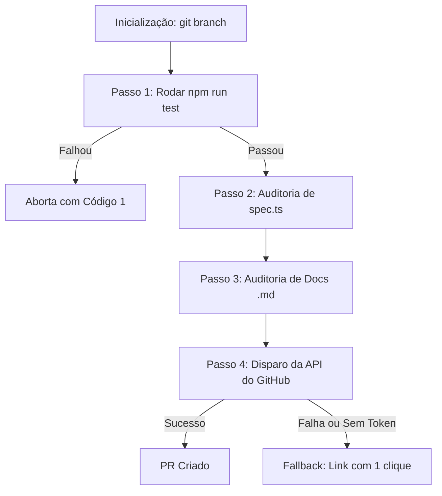

# 🤖 Skill de Automatização de Pull Request (GitHubPRSkill)

O **`GitHubPRSkill`** é a primeira implementação de automação de IA integrada ao **BaseSaas**. Trata-se de um motor local de auditoria de qualidade e criação contínua de Pull Requests para o repositório central.

*   **Caminho do Script**: `skills/GitHubPRSkill/pr-creator.js`
*   **Caminho da Especificação**: `skills/GitHubPRSkill/SKILL.md`
*   **Atalho no Terminal**: `npm run pr` ou acionando a IA por comando de execução local.

---

## 🎯 Propósitos e Utilização

Esta automação foi projetada para garantir os seguintes benefícios:
- **Aceleração de Entrega (Developer Velocity)**: Criação de PRs padronizados com um único comando, eliminando preenchimento manual e escrita de descrições complexas do zero.
- **Garantia de Qualidade (Quality Guardrails)**: Executa compilação e testes unitários locais obrigatoriamente. Se houver falhas, aborta a criação do PR.
- **Auditoria Automática de Specs (`.spec.ts`)**: Garante que modificações, exclusões ou adições de componentes lógicos possuam seus arquivos de testes correspondentes igualmente atualizados na mesma branch.
- **Auditoria de Documentação Técnica**: Caso haja mudanças em arquivos de infraestrutura (como Supabase, scripts de automação, environments), exige a atualização correspondente no README.md ou `/docs`.

---

## ⚙️ Como Configurar

Para utilizar o motor de API do script local, você deve configurar o token de autenticação pessoal do GitHub (PAT) no projeto:

1.  Gere um **Personal Access Token (Classic)** com escopo de `repo` nas suas configurações do GitHub.
2.  Abra o arquivo **`.env`** local na raiz do projeto.
3.  Adicione a sua credencial à variável `GITHUB_TOKEN`:
    ```bash
    GITHUB_TOKEN=ghp_seu_token_secreto_aqui
    ```

> [!NOTE]
> **Link de Fallback**: Se o token for um placeholder ou estiver ausente, o script gerará automaticamente um link amigável pré-preenchido de fallback para que você clique e crie o PR diretamente do navegador em um clique, porém a execução retornará código de erro 1 para manter a consistência em esteiras de CI/CD.

---

## 🧭 Pipeline de Execução (Mermaid Flow)



---

## 🔧 Como Modificar ou Expandir esta Skill

*   Para ajustar regras técnicas ou mudar o formato do sumário de commits, edite o código em **[pr-creator.js](file:///d:/Projetos/BaseSaas/skills/GitHubPRSkill/pr-creator.js)**.
*   Para alterar as orientações que a IA deve ler, atualize **[SKILL.md](file:///d:/Projetos/BaseSaas/skills/GitHubPRSkill/SKILL.md)**.
*   Você pode criar um arquivo chamado **`.pr-skill-rules.md`** na raiz do projeto para que a IA e o script executem diretrizes customizadas específicas adicionais sob demanda.
